# Explore Stage: Compounding Decomposition Strategies — Proposal

> **Status (landed):** P1 (hub) + P2 (lazy recursion) shipped in the first pass.
> A second pass then **superseded the hub strategy and the worst-leaf ranking**
> with the authorship-parallelism lens settled in [`METRIC_CALIBRATION.md`](./METRIC_CALIBRATION.md)
> and shipped via [`../../parser/CHANGES_007.md`](../../parser/CHANGES_007.md):
> P3's dominator-tree idea is realized as the **`service`** strategy (hub + its
> dominated closure + remainder components), a new **`subtree`** strategy
> (selective dominated child-workflow peeling), a coupling-aware effective
> complexity `Ec = N + Ein`, a parallel-width (max-antichain) ranking term,
> look-ahead recursion, and a `suggestContract` advisory. The text below is the
> *original* P1–P4 proposal, kept for provenance; the `hub` enum and the
> worst-leaf-only ranking it describes no longer exist.

A review/ideation deliverable for evolving the **explore** stage of
`tools/lsp/parser/decompose` from "one strategy per candidate, flat, one level"
to **compounding** decomposition, while staying inside the package's
deterministic, *informs-not-imposes* north star and a small complexity budget.

This document is **findings + recommendation + a candidate `REVISIONS` outline
only** — same posture as [`../go-cmd-lib/SURVEY.md`](../go-cmd-lib/SURVEY.md).
Nothing here is applied; no code is changed. It records the prospective work so
it isn't re-derived later. The design-of-record remains
[`BACKLOG.md`](./BACKLOG.md); this is a candidate to promote into
`internal/changes/parser/REVISIONS_NNN.md` when a cycle picks it up.

---

## 1. Why now (the two observed limits)

The explore stage today applies exactly **one strategy per candidate division**
and emits a **flat, one-level** ranked list. Run on a realistic multi-file design
(`temporal-compranda`: ~100 nodes, complexity ~1053, one weakly-connected blob)
it exposed two limits worth fixing together:

- **One-level only (depth).** The rank-1 `nexus` cut still left a `RunInnerLoop`
  section at complexity **414** (ceiling 60) with **no further breakdown**. The
  explorer cuts once and stops.
- **Single-strategy myopia (hub).** `tree` dropped out entirely because a shared
  hub workflow (`AgenticTask`, called by ~15 `Run*Agent` workflows) makes nearly
  everything mutually overlap, so the subtree-ownership strategy collapses almost
  every member into one `shared` section — no clean cut, fewer than 2 useful
  sections.

Both are failures of the *single-pass* framing, and they have a **single shared
fix** (see §4): compounding is the natural next step, and the cleverest tractable
framing folds both fixes into one mechanism rather than five.

> Note: the `temporal-compranda` numbers above are carried from the session that
> authored the plan; that design is not in this repo. Re-run on it (or an
> equivalent hub-dominated fixture) is the acceptance check in §7.

## 2. Current state (grounded)

Explore stage = two files:

- [`divisions.go`](../../../../tools/lsp/parser/decompose/divisions.go):
  `exploreDivisions` (driver over over-ceiling, ≥2-SCC chunks) →
  `exploreStrategies` (runs each requested strategy **independently**, filters
  `<2` sections and sub-floor sections, ranks) → `buildSections` (label map →
  sections + dependency DAG) → `rankDivisions` (by **max-section complexity**,
  then section count, then strategy name).
- [`strategies.go`](../../../../tools/lsp/parser/decompose/strategies.go): the
  `splitBy*` menu — `splitByTree`, `splitByNexus`, `splitByAttr`
  (worker/namespace) — plus `selectStrategies` and the `splitBy` dispatch. Each
  strategy is a `member → label` map over one chunk's members.

Output model in [`result.go`](../../../../tools/lsp/parser/decompose/result.go):
`Chunk.Divisions []Division`; each `Division` has `Strategy, Rank, Sections,
DAG, Rationale`. A `Section` is **flat** (`ID, Members, Complexity`) — there is
**no place to express a section that was itself sub-divided.** Wire schema:
`$defs/Decomposition` family in
[`twf.schema.json`](../../../../tools/lsp/cmd/twf/twf.schema.json) (`Division`
`strategy` is an `enum`; envelope is additive — `$schemaVersion` minor bumps for
new optional fields).

### Invariants to preserve (from
[`README.md`](../../../../tools/lsp/parser/decompose/README.md) + this BACKLOG)

1. **Informs, does not impose** — output is a ranked menu of suggestions;
   nothing auto-applied.
2. **Deterministic** — stable ordering, no randomness; byte-identical output for
   the same input.
3. **No opaque algorithms this pass** — min-cut / community detection are
   deferred (keep opaque strategies out so the AI stays at system scale).
4. **Context-protecting** — output stays compact enough to hand to a subagent.
5. **Loops are never cut** — a chunk (or sub-section) spanning fewer than two
   SCCs has no seam and is exempt.
6. **Floor gates every cut** — never propose a sub-chunk under the floor.

```mermaid
flowchart TD
  subgraph now [Today: one strategy / candidate, flat, one level]
    a1[over-ceiling chunk] --> a2[exploreStrategies: each strategy independent]
    a2 --> a3[rank flat Divisions by max-section complexity]
    a3 --> a4["a section may still exceed the ceiling — STOP"]
  end
  subgraph prop [Proposed: one mechanism — lazy recursive per-section selection]
    b1[over-ceiling chunk] --> b2["exploreStrategies (menu incl. hub)"]
    b2 --> b3["take local rank-1; for each section still > ceiling..."]
    b3 -->|lazy, depth-capped| b2
    b3 --> b4["rank whole compounds by worst LEAF complexity"]
  end
```

---

## 3. Phase 1 — Ideation (diverge)

### 3a. Single strategies we may be missing

Ranked by value for the two observed limits. The first three are the live
candidates; the rest are backstops/notes.

1. **Hub / shared-node extraction (high).** Peel a high-fan-in shared node (the
   hub, e.g. `AgenticTask`) into its own *shared-library* section first, leaving
   the rest separable. Deterministic; cheap (binding in-degrees, `O(n+E)`).
   Directly un-sticks the hub case. Definition: select node(s) whose in-chunk
   binding in-degree ≥ a threshold (e.g. ≥ 2 *and* in the top-fan-in tier, or
   simply the single max-fan-in node for v1), put each in its own `hub:<key>`
   section, label the remainder `core`. Note this is **distinct from** `tree`'s
   existing `shared` label: tree lumps multi-owner members into one `shared`
   bucket *without isolating the hub as its own unit and without re-rooting* the
   remaining forest; hub-extraction isolates it, which is what makes the
   *follow-on* structural cut succeed.

2. **Dominator-tree cuts (high; fast-follow).** Compute the dominator tree from
   a (virtual super-)root; a node that dominates a large subtree is a clean
   module — everything under it is reachable *only* through it. This is the
   rigorous version of `tree`'s subtree-ownership ("exclusively reachable from
   one root" ≈ "dominated by it") and it also exposes *internal* multi-level
   structure that feeds recursion. Iterative dominators are `O(n·E)` worst case
   (fine at this scale) or Lengauer–Tarjan near-linear. Transparent per-cut
   ("this subtree is reached only via X"). The hub is dominated by no single
   branch, so it stays in core and each branch peels cleanly — natural synergy
   with recursion.

3. **Caller-set signature clustering (medium-high).** Group members by the
   *set of in-chunk callers* that reach them (signature grouping, exactly the
   shape of the existing `splitByAttr`). Members called by the same caller-set
   are a feature cluster; the hub (called by everyone) gets its own signature →
   extracted for free. Cheap `O(n+E)`, fully transparent, and mirrors an
   existing pattern. A lightweight alternative to hub-extraction that achieves
   hub isolation *and* branch separation in one pass.

4. **Articulation points / bridges (medium).** Cut at vertices/edges whose
   removal disconnects the (undirected) chunk — the BACKLOG's "articulation
   seams." `O(n+E)`, classic, transparent. On hub-dominated graphs the hub *is*
   the articulation point, so this largely **coincides with hub-extraction** here
   — lower marginal value given #1, but principled for non-hub blobs.

5. **Greedy size bin-packing (low–medium; backstop).** Accrete nodes in topo
   order into bins of ≤ target complexity, starting a new bin on overflow.
   Guarantees every section ≤ target *by construction* — the **guaranteed-progress
   backstop** when structural strategies leave an over-ceiling residue (e.g. a
   wide fan of leaves). Semantically weaker boundaries; reserve as a fallback,
   not a primary.

6. **Depth / BFS-level cuts (low).** Cut by distance from roots. Simple and
   deterministic but a "layer" cross-cuts features and is a poor authoring unit.
   Keep only as a possible late balance tie-break, if at all.

7. **Leaf/utility coalescing (low).** Fold out-degree-0 trivial leaves into one
   `utilities` section to reduce section-count noise. Minor polish.

- **Explicitly out of scope this pass:** community detection, min-cut (opaque —
  deferred by the north star).

### 3b. Compounding approaches — and the convergence insight

The seeds (recursive re-division, sequential pipelines, per-section selection,
pre-pass+structural, portfolio) are **not five independent mechanisms.** They
collapse into **one**:

> **Lazy, bounded, recursive per-section strategy selection** — at each chunk run
> the existing strategy menu, take the local choice, and *recurse only into
> sections that are still over the ceiling*, depth-capped.

Mapping the seeds onto that single mechanism:

- **Recursive re-division** = the mechanism itself (the depth fix).
- **Per-section strategy selection** = the per-node engine (re-run the menu at
  each recursion node; nexus at the top, tree/dominator inside `RunInnerLoop`).
- **Sequential pipelines** ("nexus → tree") = an *emergent path* through the
  mechanism (a homogeneous/constrained recursion). No separate machinery.
- **Pre-pass + structural** ("hub-extract, then tree") = also *emergent*: add
  hub-extraction to the menu, and the compound "hub at L0 → tree at L1" appears
  on its own. **No bespoke pre-pass concept needed.**
- **Portfolio / ensemble** = keep the top candidates **at the top level only**
  (one fully-expanded compound per top-level strategy) and rank whole compounds
  against each other.

**This is the cleverest tractable framing:** build *one* mechanism (lazy
recursive per-section selection) and add *one* strategy (hub-extraction) to the
menu. Both observed limits fall out — recursion fixes depth, hub-extraction fixes
myopia — and pipelines / pre-pass+structural come for free.

### 3c. Keeping big-O tractable + the chosen bound

Let `n` = chunk nodes, `E` = chunk binding edges, `S` = strategies (4 today, 5
with hub), `D` = max recursion depth.

- **One `exploreStrategies` call:** `O(S·(n+E))` ≈ `O(S·E)`.
- **Greedy + lazy recursion** (take local rank-1, recurse only over-ceiling
  sections): sections **partition** the members, so the total work across all
  sections at any one depth is ≤ `O(S·E)`. With depth cap `D`: **`O(D·S·E)`** —
  effectively linear in the graph with a small constant.
- **Top-level portfolio** (fully expand each of the `S` top-level strategies
  greedily, then rank the `S` whole compounds): `S · O(D·S·E)` =
  **`O(D·S²·E)`**.

**Chosen bound: `O(D·S²·E)` time, `O(n)` extra space, with `D` and `S` small
constants** — low-degree polynomial, trivially within budget on the
`temporal-compranda` benchmark.

Discipline / guards (most never bind):

- **Greedy inner, beam only at the top.** No interior beam → no `k^D` blow-up.
  (Beam width >1 at interior nodes is a deferred extension, not v1.)
- **Lazy expansion** — recurse a section only if `complexity > ceiling` **and**
  `≥2 SCCs` **and** it is not below the floor.
- **`maxDepth` cap** (e.g. 4) — a safety belt; termination is *already*
  guaranteed because every division yields ≥2 sections, so each recursed section
  is a **strict subset** of its parent (the member set shrinks monotonically).
- **Memoization / dominance pruning** — *unnecessary* at this bound; noted as
  available if a future interior-beam extension needs it. Skip for v1.

Determinism is preserved: the mechanism only composes the already-deterministic
`exploreStrategies`/`rankDivisions` (sorted iteration throughout) with a
deterministic lazy-recursion order.

---

## 4. Phase 2 — Discussion (evaluate)

### 4a. Scoring against the north star

| Axis | Verdict |
|---|---|
| Informs-not-imposes | ✓ Still a ranked menu; recursion produces *nested suggestions*, still advisory. Risk: a deep tree can feel like an imposed plan — mitigate by keeping it shallow/lazy and keeping top-level flat options visible. |
| Deterministic | ✓ Composes deterministic primitives; all tie-breaks numeric+name. No randomness. |
| No opaque algorithms | ✓ Hub-extraction (in-degree), caller-set clustering (signature), and recursion are transparent. Dominator/articulation are *classic, explainable per-cut* — argued in-bounds, but see §4d: ship the unambiguously-transparent ones first. |
| Context-protecting | ⚠️ **The main tension.** A full recursive menu could explode. Controlled by: (a) **lazy** — only expand over-ceiling sections; (b) **greedy inner** — emit **one** chosen sub-division per over-ceiling section (not the full menu at depth > 0); (c) **portfolio at top level only**. Net: a few top-level divisions where *some* sections carry a single nested division. Bounded and compact. |
| Complexity budget | ✓ `O(D·S²·E)`; passes the benchmark trivially. |

### 4b. Output-shape / API impact — the core decision

Three ways to represent compound/recursive divisions:

1. **Nested `Section.Divisions []Division` (recommended).** A sub-divided
   section carries its own (single, at depth > 0) division. **Additive** — a
   `Section` keeps `Members`/`Complexity` (authoritative: it still lists *all* its
   members), and `Divisions` *refines* it. Non-recursive consumers see exactly
   today's flat top level and ignore the new field; recursion is opt-in to read.
   Schema: add optional `divisions` to `$defs/Section` (additive, `$schemaVersion`
   minor bump), and add `"hub"` to the `Division.strategy` enum.
2. **Flat with multi-pass strategy labels** (e.g. `strategy: "nexus+tree"`, path
   encoded in section IDs). Stringly-typed, loses clean per-level DAGs.
   **Rejected.**
3. **A separate division-tree type.** More invasive; breaks the tidy
   `Division`/`Section` symmetry. **Rejected for v1.**

→ **Recommendation: option 1 (additive nested sections).** Pre-v1 *and* additive
= doubly low risk; the schema's own policy says new optional fields are
non-breaking.

### 4c. Harness usability — flat menu vs walkable tree

The harness fans work to subagents at boundaries and *already recurses* its
dispatch. A **shallow, lazy walkable tree** matches that: read top-level
sections; an over-ceiling section carries an optional single nested division that
tells the subagent how to split further; the per-level DAG orders authoring.
This is strictly more useful than a flat list for recursive fan-out, and the
laziness keeps it compact. (Optional convenience — a flattened "leaf sections"
list — is **not** proposed; a consumer can derive it. Keep the model minimal.)

### 4d. Cross-candidate ranking (e.g. `nexus→tree` vs `worker→nexus`)

Today's metric (`maxSectionComplexity`, top level only) can't compare *whole
compounds*. Replace it, for compound candidates, with a **whole-decomposition
balance metric**:

- **Primary: worst *leaf*-section complexity** (the largest unit remaining after
  full recursion). A compound that leaves a 414 leaf ranks **worse** than one
  whose worst leaf is 55 — this directly encodes the goal.
- **Tie-breaks (in order):** fewer leaf sections → shallower tree depth → total
  section count → top-level strategy name. (Depth as a late tie-break prefers the
  shallower of two compounds that reach the same worst-leaf.)

All numeric + name → deterministic. Note this is a deliberate behavior change to
`rankDivisions` for the compound case (degenerates to today's behavior when
nothing recurses).

### 4e. Tensions — resolved

- **Recursion vs flat one-level →** adopt recursion, but **lazy + greedy-inner +
  depth-capped** so it stays compact and tractable. In scope for the first
  compounding pass: it's the direct fix for the most visible failure
  (`RunInnerLoop@414`) and shares the mechanism with the hub fix.
- **Data-model change vs additive →** **additive** (`Section.Divisions`, new
  `"hub"` enum). No breaking change required.
- **Completeness vs tractability →** greedy inner + top-level portfolio. Don't
  chase optimal; chase "get the worst leaf under the ceiling, cheaply,
  deterministically, compactly."

### 4f. Open questions from the plan — answered

- **Deliverable target:** this document (design-of-record-adjacent), with a
  ready-to-lift `REVISIONS` outline in §6. Promote to
  `internal/changes/parser/REVISIONS_NNN.md` when a cycle adopts it (the *parser*
  owns the code; *chunks* owns the design-of-record).
- **Recursion in scope for the first pass?** **Yes**, but sequenced as two
  independently-testable revisions (hub strategy first, then recursion).
- **Output-model change acceptable now?** **Yes — and it's additive,** so doubly
  fine given the young `chunks` schema and pre-v1 stance.
- **Hub-extraction: standalone strategy, pre-pass, or both?** **Standalone
  strategy.** Combined with recursion it *becomes* the pre-pass path with no
  bespoke machinery.

---

## 5. Phase 3 — Proposals (converge)

Recommended set, in dependency order. P1 and P2 are the pass; P3/P4 are
fast-follows.

### P1 — Hub-extraction strategy (the myopia fix)

- **Algorithm.** New `splitByHub(c)`: compute in-chunk binding in-degree per
  member; select the hub set (v1: the single max-in-degree node above a small
  threshold, e.g. in-degree ≥ 2; document the tie-break = lexicographically
  smallest on equal degree). Label each hub `hub:<key>`, everything else `core`.
  Register in `selectStrategies`/`splitBy`; add `rationaleFor`.
- **Complexity.** `O(n+E)`.
- **Schema/data delta.** Add `StrategyHub = "hub"` const; add `"hub"` to the
  `Division.strategy` enum in `twf.schema.json` (additive).
- **Tests.** Hub fixture (one shared workflow called by *k* root workflows, each
  with a private subtree): assert `tree` alone is unbalanced/absent while `hub`
  yields a clean `{hub} + {core}` split; assert determinism.
- **Acceptance.** On the hub fixture (and `temporal-compranda`), `hub` appears as
  a candidate and isolates `AgenticTask`.

### P2 — Lazy recursive re-division (the depth fix) + whole-compound ranking

- **Algorithm.** In `exploreStrategies`, after building each candidate division,
  for every section that is **over the ceiling, ≥2 SCCs, and ≥ floor**, recurse:
  re-run the menu on the section's member set, take the **local rank-1**, and
  attach it as the section's nested `Division`. Cap at `maxDepth`. Re-rank
  top-level candidates by the **worst-leaf** metric (§4d).
- **Complexity.** `O(D·S²·E)`; `maxDepth` safety cap (termination already
  guaranteed by strict subset shrinkage).
- **Schema/data delta.** Add optional `Section.Divisions []Division` (Go) and
  optional `divisions` to `$defs/Section` (schema, additive); `$schemaVersion`
  minor bump. `Members`/`Complexity` stay authoritative on every section.
- **CLI/flag surface.** Optional `--max-depth N` on `twf graph chunks` (default
  e.g. 4); recursion is automatically scoped by the existing `--ceiling`. No
  other flag changes; `--by` still filters the menu at every level.
- **Tests.** Depth fixture (rank-1 cut leaves one over-ceiling section): assert
  that section carries a nested division and that its leaves are ≤ ceiling (or as
  small as the structure allows); loop-exemption-at-depth (a sub-cycle section is
  not recursed); floor-gating-at-depth; `maxDepth` respected; **byte-identical
  output on a re-run** (determinism golden).
- **Acceptance.** On `temporal-compranda`, the `RunInnerLoop@414` section is
  recursively broken down and no leaf section exceeds the ceiling (or the
  residual is explained by loop/floor exemption).

### P3 — Dominator-tree cut strategy (fast-follow)

Rigorous subtree strategy that strengthens both `tree` and the recursion's
interior choices; exposes internal multi-level structure. Adds `"dominator"` to
the enum (additive). Defer behind P1/P2 so the pass ships the smallest fix first;
revisit whether it should *replace* or *complement* `tree`.

### P4 — Caller-set signature clustering (optional/auxiliary)

A transparent, `splitByAttr`-shaped alternative that isolates the hub *and*
separates branches in one pass. Cheap and low-risk; consider as either an
alternative to P1 or an additional menu entry. Adds `"callerset"` to the enum.

### Not in scope (restated)

Community detection, min-cut (opaque — deferred); interior beam search >1
(deferred extension); a separate division-tree type; auto-applying any cut.

---

## 6. Candidate `REVISIONS` outline (ready to lift)

> Promote to `internal/changes/parser/REVISIONS_NNN.md`. Two revision items, both
> additive to the wire contract; sole consumer is the harness skill.

**Title:** Explore-stage compounding — hub extraction + lazy recursive
re-division.

**R-1 — Hub-extraction strategy (`hub`).**
- `strategies.go`: `splitByHub`; register in `selectStrategies`/`splitBy`;
  `rationaleFor`. `result.go`: `StrategyHub` const.
- `twf.schema.json`: add `"hub"` to `Division.strategy` enum; `$schemaVersion`
  minor bump.
- Tests: hub fixture in `decompose_test.go`.

**R-2 — Lazy recursive re-division + whole-compound ranking.**
- `result.go`: add `Section.Divisions []Division` (omitempty).
- `divisions.go`: lazy depth-capped recursion in `exploreStrategies`
  (over-ceiling ∧ ≥2-SCC ∧ ≥floor sections only); switch `rankDivisions` to the
  worst-leaf metric with the §4d tie-breaks; thread `maxDepth`.
- `decompose.go`: `Options.MaxDepth` (default constant); plumb from CLI.
- `chunks.go` (cmd): `--max-depth` flag.
- `twf.schema.json`: add optional `divisions` to `$defs/Section`; `$schemaVersion`
  minor bump (may share R-1's bump if landed together).
- Tests: depth, loop-at-depth, floor-at-depth, max-depth cap, determinism golden.

**Acceptance (both):** re-run on `temporal-compranda` (or the hub + depth
fixtures): `hub` isolates the shared workflow; the deep over-ceiling section is
recursively reduced; no leaf exceeds the ceiling except where loop/floor exempts
it; output is byte-identical across runs.

**Propagation:** wire change is **additive** (new enum value + new optional
field, minor `$schemaVersion`). Visualizer / VS Code extension read the `graph`
payload and are unaffected; they may adopt nested sections later. Update the
harness/design skill docs to describe reading nested `Section.Divisions` and the
`hub` strategy.

**Sequencing:** land R-1 before R-2 (R-2's recursion benefits from `hub` in the
menu, but does not require it). P3/P4 (dominator, caller-set) are separate
fast-follow revisions, not in this pass.

---

## 7. Recommendation (one paragraph)

Build **one** mechanism and add **one** strategy. Add **hub-extraction** to the
strategy menu (R-1) to fix single-strategy myopia, and make the explorer do
**lazy, depth-capped, greedy recursive per-section selection** (R-2) to fix the
one-level limitation — ranking whole compounds by **worst-leaf complexity**.
Everything else the plan enumerated (sequential pipelines, pre-pass+structural,
per-section selection) is an *emergent path* through that single mechanism, so the
surface stays tiny. The output change is **additive** (`Section.Divisions`, new
`"hub"` enum), the cost is **`O(D·S²·E)`** with small constants, and every
invariant (informs-not-imposes, deterministic, no opaque algorithms,
context-protecting, loop-exemption, floor-gating) is preserved. Dominator-tree
and caller-set clustering are principled fast-follows; community detection and
min-cut stay deferred.
