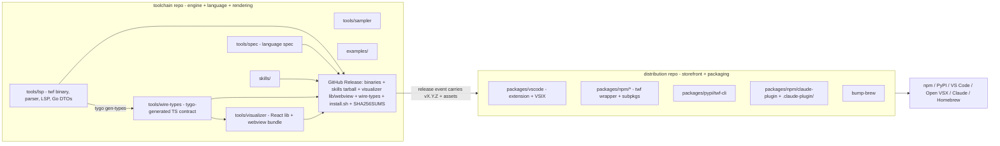

# Distribution Repo Split — Migration Plan

**Decision:** Full split. The current monorepo becomes a **pure toolchain** repo;
everything user-facing and packaged moves to a new **distribution** repo. The
toolchain repo emits primitive release artifacts (binary, skills tarball, spec,
the visualizer rendering library + webview bundle, and the generated wire-types
contract); the distribution repo consumes those artifacts and produces every
shippable package.

**Goal:** declutter the toolchain and its development from packaging/distribution.
Directory-based separation has hit a hard ceiling because two distribution
artifacts are forced to fixed in-repo paths by external tools and cannot be
confined to a folder:

- `.github/workflows/` — GitHub requires it; 9 of 12 workflow files are publish machinery.
- `.claude-plugin/marketplace.json` — Claude Code requires it at the **repo root**.

A separate repo is the only structure that gives packaging its own clean root and
removes both forced-root offenders from the toolchain.

> This is a plan only. Nothing here is applied. The directory name corrects the
> requested `distrubution` typo to `distribution`.

---

## 1. End-state: two repos, one clean cut

The cut is **engine vs. everything a user installs or sees.**



**Toolchain repo owns** the things that are *the product engine and the
rendering capability*: the Go binary, the language spec, the sampler, the skills
(source), examples, the **visualizer source** (React lib + webview bundle), the
**wire-types contract** (Go DTOs → tygo → `@temporal-architect/wire-types`), and
the dev-cycle apparatus that develops them. It **cuts the GitHub Release**
(binaries + `skills-vX.Y.Z.tar.gz` + the visualizer lib tarball + the webview
bundle + the wire-types tarball + `install.sh` + `SHA256SUMS`) — the canonical,
durable artifacts everything downstream pins to.

**Distribution repo owns** every *packaging* surface: the VS Code/Cursor
extension + VSIX, the npm wrapper + platform sub-packages, the PyPI wheel, the
Claude Code plugin payload + marketplace catalog, the Homebrew formula bumper,
and all the publish workflows + secrets. It **consumes** the toolchain's release
assets — binary, skills, visualizer lib/webview, wire-types — and produces
shippable packages. Dist holds no React/Go source build; it downloads, repackages,
and publishes.

---

## 2. Which repo keeps the name

We can move the toolchain out or the distribution out. They are not symmetric —
external coordinates make one direction far cheaper.

### Recommended — Direction 1: toolchain **stays** in `jmbarzee/temporal-architect`; distribution spins out (e.g. `jmbarzee/temporal-architect-dist`).

Rationale: the toolchain owns the immovable external coordinates.

| Coordinate | If toolchain stays put (Dir 1) | If toolchain moves out (Dir 2) |
|---|---|---|
| `go install github.com/jmbarzee/temporal-architect/tools/lsp/cmd/twf` | unchanged | **breaks** — new module path |
| GitHub Release asset URLs (install.sh, brew formula pin to these) | unchanged | all move; install.sh/brew URLs churn |
| `curl .../temporal-architect/releases/latest/.../install.sh` | unchanged | changes |
| Repo history / stars / issues on the engine | stay | move to a new name |
| Claude `/plugin marketplace add jmbarzee/<repo>` | → points at the dist repo (acceptable, pre-v1) | stays `temporal-architect` |

Direction 1 wins: it preserves every durable URL. The one cost is that the Claude
marketplace-add command and the `repository` link on registry listings point at
the dist repo. Neutralize the branding wrinkle with the homepage/repository split
below.

### Keep the toolchain repo as the front door

Registries let `homepage` and `repository` differ. Set, on every dist-owned manifest:

- `homepage` → `https://github.com/jmbarzee/temporal-architect` (the pitch + docs)
- `repository` → the dist repo (where that manifest's source actually lives)

So a user discovering via npm/PyPI/Marketplace still lands on the engine repo's
README (the front door), while "view source of this package" resolves correctly.
Registry **identifiers** (npm scope `@temporal-architect`, PyPI `twf-cli`, VSIX id
`jmbarzee.twf-syntax`) are immutable and unaffected — only metadata URLs change.

---

## 3. Inventory — what moves, what stays

### Moves to the distribution repo

| Path today | Notes |
|---|---|
| `packages/vscode/` | Extension source (`src/extension.ts`), manifest, VSIX build. Consumes wire-types type-only (`file:` → published dep) and the downloaded webview bundle. |
| `packages/npm/twf/` + `packages/npm/twf-*/` | Wrapper + 5 platform sub-packages (repackage the binary). |
| `packages/pypi/twf-cli/` | Wheel (repackages the binary). |
| `packages/npm/claude-plugin/` + `.claude-plugin/marketplace.json` | Plugin payload + the forced-root catalog — now legitimately at the **dist** root. |
| `internal/release/bump-brew/` | Writes the formula to the existing tap repo; consumes toolchain release URLs/SHAs. |
| `_publish-vsix.yml`, `_publish-npm-twf.yml`, `_publish-npm-visualizer.yml`, `_publish-npm-claude-plugin.yml`, `_publish-pypi.yml`, `_publish-brew.yml` | All registry publishers. **Note:** `_publish-npm-visualizer` and a new `_publish-npm-wire-types` only *publish* prebuilt tarballs downloaded from the toolchain release — the *build* of both stays toolchain-side. |
| `_check-versions.yml` (a dist-scoped copy) | Validates dist manifests against the incoming version. |
| `publishing_setup.md`, packaging sections of `packaging.md` | Distribution docs. |
| `packages/vscode/README.md`, package READMEs | Storefront copy. |
| Secrets: `VSCE_TOKEN`, `OVSX_TOKEN`, `NPM_TOKEN`, `PYPI_TOKEN`, `HOMEBREW_TAP_TOKEN` | Move to dist repo settings. |

### Stays in the toolchain repo

| Path today | Notes |
|---|---|
| `tools/lsp/` | The binary, parser, resolver, validator, LSP, `twf` CLI. Owns the **Go DTO layer** — the wire contract, projected to TS by `tools/wire-types` (the hand-maintained `twf.schema.json` is retired). |
| `tools/wire-types/` | `@temporal-architect/wire-types` — tygo-generated TS projection of the Go DTOs, gated by `make check-types`. Generated from `tools/lsp`, so it stays toolchain-side and ships as a published release artifact. |
| `tools/visualizer/` | React rendering library + its spec (`PRODUCT.md`, `TREE_VIEW.md`, `GRAPH_VIEW.md`). Consumes wire-types in-tree (`file:`). Toolchain builds two release assets from it: the npm lib tarball and the webview IIFE bundle. |
| `tools/spec/` | Canonical language spec (embedded in the binary). |
| `tools/sampler/` | History collector. |
| `skills/` | Skill source. Toolchain cuts the skills tarball release asset. |
| `examples/` | Example `.twf` files (incl. the validated storefront sample). |
| `internal/release/gen-skills-manifest/` | Produces `skills-vX.Y.Z.tar.gz` — a **release** concern (toolchain cuts the release). |
| `internal/harness/`, `internal/orchestrator/`, `.claude/skills/dev-cycle/`, `internal/changes/` | Dev apparatus for the toolchain (now incl. the parser↔visualizer alignment + visualizer quality/spec reviews, which stay in-tree). |
| `packages/install.sh` + `_publish-github-release.yml` + `_build-binaries.yml` + `_build-skills-tarball.yml` | Cutting the GitHub Release (binaries + skills tarball + visualizer lib/webview + wire-types + install.sh + checksums). install.sh is a thin downloader attached to the **toolchain's** release page — it must live where the release is cut. |
| `README.md`, `AGENTS.md` | Engine pitch + contributor guide (front door). |

### Special cases / judgment calls

- **`install.sh` and the GitHub Release stay with the toolchain.** They are not
  "packaging to a registry" — they *are* the canonical release. Brew + the dist
  packages pin to these URLs. (Mirrors how the Homebrew tap already consumes
  toolchain release URLs.)
- **The visualizer source stays in the toolchain** (revised from an earlier
  draft that moved it to dist). It is welded to the wire contract — `make
  gen-types` runs tygo against the `tools/lsp` Go DTOs and `check-types` gates
  the result — so keeping it beside the parser keeps that generation and the
  parser↔visualizer alignment review a single-tree concern. The toolchain emits
  the visualizer as two release assets (npm lib tarball + webview IIFE bundle);
  dist downloads them. This converts the plan's single biggest structural cost
  into a typed, versioned contract (see §5).
- **`tools/wire-types` stays in the toolchain** for the same reason — it is the
  generated contract itself. It ships as `@temporal-architect/wire-types@X.Y.Z`,
  a published release artifact alongside the binary and skills tarball.

---

## 4. Release wiring (lockstep across two repos)

```mermaid
sequenceDiagram
  participant Dev
  participant TC as toolchain repo CI
  participant GH as GitHub Release (vX.Y.Z)
  participant D as distribution repo CI
  Dev->>TC: git tag vX.Y.Z (make release)
  TC->>TC: build 5x binaries, skills tarball, visualizer lib+webview, wire-types tarball, install.sh, SHA256SUMS
  TC->>GH: create Release with assets
  TC->>D: repository_dispatch {version: vX.Y.Z}
  D->>GH: download binary archives + skills + visualizer lib/webview + wire-types
  D->>D: stamp manifests to X.Y.Z; unpack assets into VSIX; assemble npm/pypi/plugin
  D->>D: _check-versions (manifests == vX.Y.Z)
  D-->>D: publish to all registries (incl. visualizer + wire-types tarballs); bump brew
```

- **Trigger:** toolchain's `_publish-github-release` final step fires a
  `repository_dispatch` to the dist repo carrying `version`. Needs a PAT
  (`DIST_DISPATCH_TOKEN`) in the toolchain repo with `repo` scope on dist. (Alt:
  dist subscribes to the toolchain's `release` event via a scheduled poll or a
  GitHub App — dispatch-with-PAT is the simplest.)
- **Version source of truth:** the tag, carried in the dispatch payload. Dist does
  not tag independently; it stamps the incoming version into its manifests at
  build time. Lockstep is automatic — no manual two-repo coordination.
- **Asset flow:** dist downloads `twf-vX.Y.Z-<os>-<arch>.{tar.gz,zip}` for npm
  sub-packages / pypi wheels / VSIX bundling; `skills-vX.Y.Z.tar.gz` for the
  VSIX + claude-plugin payloads; the **visualizer webview bundle** to embed in
  the VSIX; and the **visualizer lib** and **wire-types** tarballs to re-publish
  to npm (and to install locally for the extension's type-only build). Dist needs
  no React/Go/vite build of its own — it unpacks and repackages. (The skills
  tarball asset already exists and is documented as a downstream-pinning contract
  in `skills/MANIFEST.md`.)
- **Build vs. publish split:** `@temporal-architect/visualizer` and
  `@temporal-architect/wire-types` are *built* in the toolchain (where their
  source + version stamp live) and *published* from dist (which downloads the
  prebuilt tarball and `npm publish`es it). This keeps all registry tokens in
  dist while keeping all source-builds in the toolchain.
- **Secrets:** publish secrets live in dist; the toolchain keeps only
  `GITHUB_TOKEN` + `DIST_DISPATCH_TOKEN`.

---

## 5. Contract seams to manage after the split

Keeping the visualizer and wire-types in the toolchain leaves only **packaging**
contracts crossing the boundary — each a versioned, downloadable asset. There is
no longer a JSON-schema seam to re-validate; the wire contract is a typed,
version-pinned npm package.

| Contract | Producer (toolchain) | Consumer (dist) | Guard |
|---|---|---|---|
| **Wire types** | `tools/lsp` Go DTOs → tygo → `@temporal-architect/wire-types` (gated in-tree by `make check-types`) | extension (type-only) | Dist depends on the published, version-pinned `@temporal-architect/wire-types@X.Y.Z` as a normal npm dep. The in-repo `file:../wire-types` / `file:../../tools/wire-types` dev-deps convert to that published dep on split. Type-only, so it is erased at compile time — no runtime coupling. |
| **Visualizer** | `tools/visualizer` lib tarball + webview IIFE bundle (built in-tree) | VSIX (webview), npm re-publish | Versioned release assets pinned to the tag; dist embeds the webview bundle and re-publishes the lib tarball unchanged. |
| **Skills tarball** | `gen-skills-manifest` → `skills-vX.Y.Z.tar.gz` | VSIX bundle, claude-plugin payload | Already a stable contract (`skills/MANIFEST.md`); dist verifies checksum. |
| **Language spec** | `tools/spec/sections/*.md` (embedded in binary; `twf spec`) | docs/storefront copy referencing constructs | Storefront pulls construct lists from `twf spec` output, not hand-copied. |

**Dev-cycle impact (now small).** Because the visualizer and wire-types stay in
the toolchain, the parser↔visualizer alignment review
(`review-alignment-parser-visualizer`) and the visualizer quality/spec reviews
**stay in-tree** — the seam that was the plan's biggest dev-cycle cost is gone.
After the split:

- The toolchain repo keeps parser/resolver, spec, wire-types, visualizer,
  design-skill, and author-skill reviews — i.e. everything contract-bearing.
- The dist repo's dev-cycle is **extension-only** (VSIX packaging + the
  consume-release wiring), anchored on the published `wire-types` package version.
- `components.md` splits along that line; the only cross-repo edge is "the
  extension pins a wire-types/visualizer version," reviewed when dist bumps to a
  new release — a version bump, not a JSON-schema diff.

---

## 6. Migration steps (ordered, reversible)

1. **Create the dist repo** `jmbarzee/temporal-architect-dist` (empty, public).
2. **Seed dist history-preserving** (decided): run `git filter-repo` **on a fresh
   clone** of the toolchain (never in-place — that would rewrite toolchain SHAs)
   to keep only the moved subtrees with their history, then push to dist. Path set:
   `packages/vscode/`, `packages/npm/`, `packages/pypi/`, `.claude-plugin/`,
   `internal/release/bump-brew/`, `publishing_setup.md`, and the six
   `.github/workflows/_publish-*.yml` publishers + `_check-versions.yml`.
   **Exclude `packages/install.sh`** (stays toolchain-side) and **do not** include
   `tools/visualizer` or `tools/wire-types` (both stay toolchain-side). This
   preserves continuous blame on `extension.ts` + `bump-brew`; expect version-bump
   churn to dominate the rest.
3. **Toolchain repo: strip** the moved paths via an ordinary `git rm` commit (no
   filter-repo — full history is retained, deleted files reachable via
   `git log --follow`). **Keep** `tools/visualizer`, `tools/wire-types`,
   `packages/install.sh`, `_build-binaries`, `_build-skills-tarball`,
   `_publish-github-release`, and a reduced `_check-versions` (visualizer +
   wire-types manifests only). Add release steps that build + upload the
   **visualizer lib tarball**, **webview bundle**, and **wire-types tarball**;
   retarget `vite.webview.config.ts`'s `outDir` out of `packages/vscode` into a
   local toolchain `dist/` dir. Reduce the Makefile to build/test/release-cut
   targets and add the `repository_dispatch` step + `DIST_DISPATCH_TOKEN`.
4. **Dist repo: stand up** its own Makefile (download + repackage + publish
   targets, no source build), a `_consume-release.yml` entry workflow keyed on
   `repository_dispatch` that downloads all release assets, the moved `_publish-*`
   workflows (with `_publish-npm-visualizer` + a new `_publish-npm-wire-types`
   reduced to "publish the downloaded tarball"), a dist-scoped `_check-versions`,
   and all publish secrets. Convert the extension's `file:../../tools/wire-types`
   dev-dep to the published `@temporal-architect/wire-types@X.Y.Z`.
5. **Rewrite cross-repo references:** dist manifests' `homepage` → toolchain repo,
   `repository` → dist; toolchain README points to dist for "how it ships."
6. **Move secrets** to the dist repo; remove them from the toolchain repo.
7. **Dry-run** a release end-to-end on a throwaway tag (`v0.0.0-rc`): toolchain
   cuts the release → dispatch → dist builds + publishes to test channels
   (npm dry-run, TestPyPI, a scratch VSIX) without touching production listings.
8. **Cut the first real split release** and smoke-test each channel per
   `publishing_setup.md`'s first-publish matrix (now living in dist).
9. **Update `packaging.md`/`AGENTS.md`** project-layout + dependency-map sections
   to describe the two-repo topology.

---

## 7. Costs & risks (stated plainly)

- **Cross-repo release hop.** One workflow graph becomes two linked by an event —
  more surface to debug when a publish fails. Mitigate with the RC dry-run lane.
- **Dev-cycle fragmentation — largely eliminated.** Keeping the visualizer and
  wire-types in the toolchain leaves the dist dev-cycle extension-only; the
  parser↔visualizer contract review stays a single-tree concern (§5). The residual
  cost is the new toolchain → dist asset surface (more release artifacts to
  produce and consume), not a fragmented review loop.
- **Two CI + two secret sets.** Slightly more ops; but publish secrets leave the
  toolchain entirely, which is also a security win.
- **Context cost vs. the North Star.** Two repos = more context-switching for a
  small maintainer. Justified only if packaging genuinely interrupts toolchain
  work today; if packaging mostly sits idle between releases, weigh that honestly.
- **Claude marketplace-add path changes** to the dist repo (pre-v1, low blast).

---

## 8. Rollback

The split is reversible until the dist repo cuts its first production release.
Before that point: re-merge the dist tree back, restore the `_publish-*`
workflows + secrets, drop the dispatch. After production publishes exist, rollback
means re-consolidating manifests and resuming single-repo releases — no registry
state is lost (identifiers never moved), so it is recoverable, just noisy.
