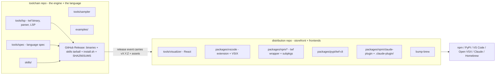

# Distribution Repo Split — Migration Plan

**Decision:** Full split. The current monorepo becomes a **pure toolchain** repo;
everything user-facing and packaged moves to a new **distribution** repo. The
toolchain repo emits primitive release artifacts (binary, skills tarball, spec,
the JSON contract); the distribution repo consumes those artifacts and produces
every shippable package.

**Goal:** declutter the toolchain and its development from packaging/distribution.
Directory-based separation has hit a hard ceiling because two distribution
artifacts are forced to fixed in-repo paths by external tools and cannot be
confined to a folder:

- `.github/workflows/` — GitHub requires it; 9 of 12 workflow files are publish machinery.
- `.claude-plugin/marketplace.json` — Claude Code requires it at the **repo root**.

A separate repo is the only structure that gives packaging its own clean root and
removes both forced-root offenders from the toolchain.

> This is a plan only. Nothing here is applied. The directory name corrects the
> requested `distrubution` typo to `distribution`.

---

## 1. End-state: two repos, one clean cut

The cut is **engine vs. everything a user installs or sees.**



**Toolchain repo owns** the things that are *the product engine*: the Go binary,
the language spec, the sampler, the skills (source), examples, the JSON output
contract (`twf.schema.json`), and the dev-cycle apparatus that develops them. It
**cuts the GitHub Release** (binaries + `skills-vX.Y.Z.tar.gz` + `install.sh` +
`SHA256SUMS`) — the canonical, durable artifacts everything downstream pins to.

**Distribution repo owns** every consumer-facing surface: the visualizer (React
frontend), the VS Code/Cursor extension + VSIX, the npm wrapper + platform
sub-packages, the PyPI wheel, the Claude Code plugin payload + marketplace
catalog, the Homebrew formula bumper, and all the publish workflows + secrets. It
**consumes** the toolchain's release assets and produces shippable packages.

---

## 2. Which repo keeps the name

We can move the toolchain out or the distribution out. They are not symmetric —
external coordinates make one direction far cheaper.

### Recommended — Direction 1: toolchain **stays** in `jmbarzee/temporal-architect`; distribution spins out (e.g. `jmbarzee/temporal-architect-dist`).

Rationale: the toolchain owns the immovable external coordinates.

| Coordinate | If toolchain stays put (Dir 1) | If toolchain moves out (Dir 2) |
|---|---|---|
| `go install github.com/jmbarzee/temporal-architect/tools/lsp/cmd/twf` | unchanged | **breaks** — new module path |
| GitHub Release asset URLs (install.sh, brew formula pin to these) | unchanged | all move; install.sh/brew URLs churn |
| `curl .../temporal-architect/releases/latest/.../install.sh` | unchanged | changes |
| Repo history / stars / issues on the engine | stay | move to a new name |
| Claude `/plugin marketplace add jmbarzee/<repo>` | → points at the dist repo (acceptable, pre-v1) | stays `temporal-architect` |

Direction 1 wins: it preserves every durable URL. The one cost is that the Claude
marketplace-add command and the `repository` link on registry listings point at
the dist repo. Neutralize the branding wrinkle with the homepage/repository split
below.

### Keep the toolchain repo as the front door

Registries let `homepage` and `repository` differ. Set, on every dist-owned manifest:

- `homepage` → `https://github.com/jmbarzee/temporal-architect` (the pitch + docs)
- `repository` → the dist repo (where that manifest's source actually lives)

So a user discovering via npm/PyPI/Marketplace still lands on the engine repo's
README (the front door), while "view source of this package" resolves correctly.
Registry **identifiers** (npm scope `@temporal-architect`, PyPI `twf-cli`, VSIX id
`jmbarzee.twf-syntax`) are immutable and unaffected — only metadata URLs change.

---

## 3. Inventory — what moves, what stays

### Moves to the distribution repo

| Path today | Notes |
|---|---|
| `tools/visualizer/` | React frontend + its spec (`PRODUCT.md`, `TREE_VIEW.md`, `GRAPH_VIEW.md`). Consumes the parser JSON contract. |
| `packages/vscode/` | Extension source (`src/extension.ts`), manifest, VSIX build. |
| `packages/npm/twf/` + `packages/npm/twf-*/` | Wrapper + 5 platform sub-packages (repackage the binary). |
| `packages/pypi/twf-cli/` | Wheel (repackages the binary). |
| `packages/npm/claude-plugin/` + `.claude-plugin/marketplace.json` | Plugin payload + the forced-root catalog — now legitimately at the **dist** root. |
| `internal/release/bump-brew/` | Writes the formula to the existing tap repo; consumes toolchain release URLs/SHAs. |
| `_publish-vsix.yml`, `_publish-npm-twf.yml`, `_publish-npm-visualizer.yml`, `_publish-npm-claude-plugin.yml`, `_publish-pypi.yml`, `_publish-brew.yml` | All registry publishers. |
| `_check-versions.yml` (a dist-scoped copy) | Validates dist manifests against the incoming version. |
| `publishing_setup.md`, packaging sections of `packaging.md` | Distribution docs. |
| `packages/vscode/README.md`, package READMEs | Storefront copy. |
| Secrets: `VSCE_TOKEN`, `OVSX_TOKEN`, `NPM_TOKEN`, `PYPI_TOKEN`, `HOMEBREW_TAP_TOKEN` | Move to dist repo settings. |

### Stays in the toolchain repo

| Path today | Notes |
|---|---|
| `tools/lsp/` | The binary, parser, resolver, validator, LSP, `twf` CLI. Owns `twf.schema.json` (the JSON contract). |
| `tools/spec/` | Canonical language spec (embedded in the binary). |
| `tools/sampler/` | History collector. |
| `skills/` | Skill source. Toolchain cuts the skills tarball release asset. |
| `examples/` | Example `.twf` files (incl. the validated storefront sample). |
| `internal/release/gen-skills-manifest/` | Produces `skills-vX.Y.Z.tar.gz` — a **release** concern (toolchain cuts the release). |
| `internal/harness/`, `internal/orchestrator/`, `.claude/skills/dev-cycle/`, `internal/changes/` | Dev apparatus for the toolchain. |
| `packages/install.sh` + `_publish-github-release.yml` + `_build-binaries.yml` + `_build-skills-tarball.yml` | Cutting the GitHub Release (binaries + skills tarball + install.sh + checksums). install.sh is a thin downloader attached to the **toolchain's** release page — it must live where the release is cut. |
| `README.md`, `AGENTS.md` | Engine pitch + contributor guide (front door). |

### Special cases / judgment calls

- **`install.sh` and the GitHub Release stay with the toolchain.** They are not
  "packaging to a registry" — they *are* the canonical release. Brew + the dist
  packages pin to these URLs. (Mirrors how the Homebrew tap already consumes
  toolchain release URLs.)
- **The visualizer source moves with its packages.** Consequence: the
  parser→visualizer contract and the visualizer-spec reviews now cross the repo
  boundary (see §5). This is the single biggest structural cost of "full" vs. a
  narrower split; it is accepted, with mitigations in §5.

---

## 4. Release wiring (lockstep across two repos)

```mermaid
sequenceDiagram
  participant Dev
  participant TC as toolchain repo CI
  participant GH as GitHub Release (vX.Y.Z)
  participant D as distribution repo CI
  Dev->>TC: git tag vX.Y.Z (make release)
  TC->>TC: build 5x binaries, skills tarball, install.sh, SHA256SUMS
  TC->>GH: create Release with assets
  TC->>D: repository_dispatch {version: vX.Y.Z}
  D->>GH: download binary archives + skills tarball
  D->>D: stamp manifests to X.Y.Z; build visualizer + VSIX; assemble npm/pypi/plugin
  D->>D: _check-versions (manifests == vX.Y.Z)
  D-->>D: publish to all registries; bump brew
```

- **Trigger:** toolchain's `_publish-github-release` final step fires a
  `repository_dispatch` to the dist repo carrying `version`. Needs a PAT
  (`DIST_DISPATCH_TOKEN`) in the toolchain repo with `repo` scope on dist. (Alt:
  dist subscribes to the toolchain's `release` event via a scheduled poll or a
  GitHub App — dispatch-with-PAT is the simplest.)
- **Version source of truth:** the tag, carried in the dispatch payload. Dist does
  not tag independently; it stamps the incoming version into its manifests at
  build time. Lockstep is automatic — no manual two-repo coordination.
- **Asset flow:** dist downloads `twf-vX.Y.Z-<os>-<arch>.{tar.gz,zip}` for npm
  sub-packages / pypi wheels / VSIX bundling, and `skills-vX.Y.Z.tar.gz` for the
  VSIX + claude-plugin payloads. (The skills tarball asset already exists and is
  documented as a downstream-pinning contract in `skills/MANIFEST.md`.)
- **Secrets:** publish secrets live in dist; the toolchain keeps only
  `GITHUB_TOKEN` + `DIST_DISPATCH_TOKEN`.

---

## 5. Contract seams to manage after the split

The split converts three in-tree couplings into cross-repo contracts. Each needs
an explicit owner + drift guard.

| Contract | Producer (toolchain) | Consumer (dist) | Guard |
|---|---|---|---|
| **Parse/AST JSON** | `twf parse` + `twf.schema.json` | visualizer, extension | Pin the schema; dist CI validates fixtures against the published `twf.schema.json` (downloaded from the toolchain release/tag). |
| **Skills tarball** | `gen-skills-manifest` → `skills-vX.Y.Z.tar.gz` | VSIX bundle, claude-plugin payload | Already a stable contract (`skills/MANIFEST.md`); dist verifies checksum. |
| **Language spec** | `tools/spec/sections/*.md` (embedded in binary; `twf spec`) | docs/storefront copy referencing constructs | Storefront pulls construct lists from `twf spec` output, not hand-copied. |

**Dev-cycle impact (the real cost).** The dev-cycle harness in
`internal/harness/components.md` + `.claude/skills/dev-cycle/` currently runs the
parser↔visualizer alignment review (`review-alignment-parser-visualizer`) and the
visualizer quality/spec reviews in-tree. After the split:

- The toolchain repo keeps parser/resolver, spec, design-skill, author-skill reviews.
- The dist repo gets its own dev-cycle for visualizer + extension reviews, anchored
  on the **published JSON contract** rather than a sibling directory.
- `components.md` splits along the same line; the cross-repo edge (parser JSON →
  visualizer) becomes a versioned contract review triggered when the schema asset
  changes, not a same-tree diff.

This fragmentation is inherent to moving the visualizer source. If it proves too
costly, the fallback is to keep `tools/visualizer` **source** in the toolchain and
have dist publish a prebuilt `visualizer-lib` release asset (a narrower split) —
recorded here as the one reversible sub-decision.

---

## 6. Migration steps (ordered, reversible)

1. **Create the dist repo** `jmbarzee/temporal-architect-dist` (empty, public).
2. **Move history-preserving** (optional): use `git filter-repo` to extract
   `tools/visualizer`, `packages/`, `.claude-plugin/`, `internal/release/bump-brew`
   into the dist repo with history. Otherwise a clean copy.
3. **Toolchain repo: strip** the moved paths; reduce the Makefile to
   build/test/release-cut targets; delete the registry `_publish-*` workflows;
   keep `_build-binaries`, `_build-skills-tarball`, `_publish-github-release`; add
   the `repository_dispatch` step + `DIST_DISPATCH_TOKEN`.
4. **Dist repo: stand up** its own Makefile (repackage/publish targets), a
   `_consume-release.yml` entry workflow keyed on `repository_dispatch`, the moved
   `_publish-*` workflows, a dist-scoped `_check-versions`, and all publish secrets.
5. **Rewrite cross-repo references:** dist manifests' `homepage` → toolchain repo,
   `repository` → dist; toolchain README points to dist for "how it ships."
6. **Move secrets** to the dist repo; remove them from the toolchain repo.
7. **Dry-run** a release end-to-end on a throwaway tag (`v0.0.0-rc`): toolchain
   cuts the release → dispatch → dist builds + publishes to test channels
   (npm dry-run, TestPyPI, a scratch VSIX) without touching production listings.
8. **Cut the first real split release** and smoke-test each channel per
   `publishing_setup.md`'s first-publish matrix (now living in dist).
9. **Update `packaging.md`/`AGENTS.md`** project-layout + dependency-map sections
   to describe the two-repo topology.

---

## 7. Costs & risks (stated plainly)

- **Cross-repo release hop.** One workflow graph becomes two linked by an event —
  more surface to debug when a publish fails. Mitigate with the RC dry-run lane.
- **Dev-cycle fragmentation** for the visualizer (§5) — the biggest cost; has a
  documented fallback (keep visualizer source in toolchain).
- **Two CI + two secret sets.** Slightly more ops; but publish secrets leave the
  toolchain entirely, which is also a security win.
- **Context cost vs. the North Star.** Two repos = more context-switching for a
  small maintainer. Justified only if packaging genuinely interrupts toolchain
  work today; if packaging mostly sits idle between releases, weigh that honestly.
- **Claude marketplace-add path changes** to the dist repo (pre-v1, low blast).

---

## 8. Rollback

The split is reversible until the dist repo cuts its first production release.
Before that point: re-merge the dist tree back, restore the `_publish-*`
workflows + secrets, drop the dispatch. After production publishes exist, rollback
means re-consolidating manifests and resuming single-repo releases — no registry
state is lost (identifiers never moved), so it is recoverable, just noisy.
