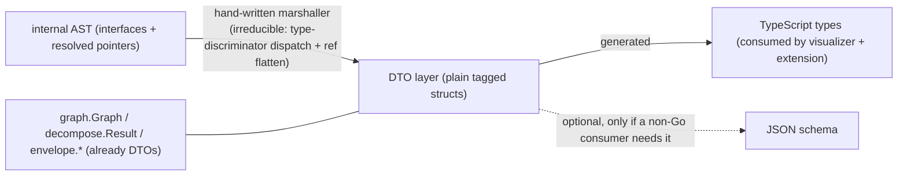

# twf Wire-Contract: Generate, Don't Hand-Maintain

A plan to collapse the **hand-maintained duplication of `twf`'s JSON wire
contract** by generating the consumer-facing types from the Go DTO layer — with
the Go structs as the single source of truth, CI-gated against drift, and
**without polluting the parser packages**.

This document is a **plan only** — same posture as
[`../go-cmd-lib/SURVEY.md`](../go-cmd-lib/SURVEY.md) and
[`../chunks/COMPOUNDING_PROPOSAL.md`](../chunks/COMPOUNDING_PROPOSAL.md). Nothing
here is applied. It records the design and a work breakdown so it can be promoted
to `internal/changes/parser/REVISIONS_NNN.md` (and/or a `visualizer` revision)
when a cycle picks it up.

---

## 1. Why (the problem)

`twf`'s output contract — the JSON envelope emitted by `parse`, `symbols --json`,
`graph --json`, and `graph chunks --json` — currently exists as **four
hand-synced copies of the same shapes**:

- the **Go structs** (`envelope`, `graph`, `decompose`, `ast/json.go` DTOs) —
  the only *executable* copy (they actually produce the JSON);
- [`tools/lsp/cmd/twf/twf.schema.json`](../../../../tools/lsp/cmd/twf/twf.schema.json)
  — a JSON Schema **nothing consumes at runtime** (no validation, no codegen);
- [`tools/visualizer/src/types/parser-graph.ts`](../../../../tools/visualizer/src/types/parser-graph.ts)
  and [`ast.ts`](../../../../tools/visualizer/src/types/ast.ts) — TS mirrors,
  hand-kept "in lockstep";
- [`packages/vscode/src/extension.ts`](../../../../packages/vscode/src/extension.ts)
  — a **third** hand-copy of `Diagnostic`.

Each is synced by whoever remembers; there is no CI gate tying them together
(unlike `COMMANDS.md`, which is gated by `make check-docs`). The schema in
particular *claims* to be authoritative but is neither the source nor consumed —
it is pure drift surface.

### Key finding (the reframe)

The contract has exactly **one source that must exist: the Go structs** — they
execute. Everything else is a *projection* that should be **generated**, and only
for consumers that genuinely need that form. The only real programmatic consumers
today are the **two TypeScript packages** (visualizer + extension); they need TS
types, not a JSON Schema.

## 2. Goal / non-goals

**Goal.** Generate the TypeScript types for `twf`'s wire contract from the Go DTO
layer, make the visualizer and extension consume the generated output, and gate
it in CI so the contract cannot drift. Decide the fate of the standalone JSON
schema in the same pass.

**Non-goals.**

- No change to the *runtime* JSON output (byte-for-byte identical — this only
  changes how the *type descriptions* are produced).
- No `jsonschema`/codegen struct tags or generator imports added to the parser
  packages (`ast`, `graph`, `decompose`) — see §6.
- Not migrating the schema's hand-written prose into Go comments in this pass —
  instead we inventory it for review (§5, task T7).

## 3. The source-of-truth principle: generate from the DTO layer

Every payload already has a **flat, JSON-tagged DTO** that the marshaller targets
— that is the generation source:

The AST is the only payload with a thick internal→DTO step (the 1068-line
[`ast/json.go`](../../../../tools/lsp/parser/ast/json.go) marshaller), but its
DTO structs (`WorkflowDefJSON`, `QueryDeclJSON`, `OptionEntryJSON`, …) are
**already plain exported tagged structs** — i.e. generatable. The hand-written Go
marshaller stays (interface dispatch + cycle-breaking can't be reflected) but
that is a *producer*, not a contract copy.

## 4. Inventory: payload → DTO source → consumer

- `summary` → `ast.FileSummary` ([`ast/json.go`](../../../../tools/lsp/parser/ast/json.go)) → visualizer.
- `diagnostics` → `envelope.Diagnostic` + `envelope.Position` ([`envelope/model.go`](../../../../tools/lsp/cmd/twf/internal/envelope/model.go)) → visualizer **and** extension (currently triplicated).
- `definitions` (`twf parse`) → the `*JSON` DTO structs in [`ast/json.go`](../../../../tools/lsp/parser/ast/json.go) → visualizer (`ast.ts`).
- `symbols` (`twf symbols --json`) → `symbolJSON` / `subSymbol` in [`symbols.go`](../../../../tools/lsp/cmd/twf/internal/command/symbols/symbols.go) — **currently unexported** (T-fix) → no TS consumer today (schema stub only).
- `graph` (`twf graph --json`) → `graph.Graph` family ([`graph/graph.go`](../../../../tools/lsp/parser/graph/graph.go)) → visualizer (`parser-graph.ts`).
- `chunks` (`twf graph chunks --json`) → `decompose.Result` family ([`decompose/result.go`](../../../../tools/lsp/parser/decompose/result.go)) → **harness skill / agents only**; no TS consumer yet (generate for completeness, forward-looking).
- Non-JSON commands (`check`, `spec`, `lsp`, `version`, `completion`) → no JSON payload → **out of scope**.

## 5. Approach

**Generator.** Use a Go→TS type generator (`tygo` is the standard) driven by a
config that lists the DTO packages/types. It reads Go source: `json:"..."` tags →
field names, `omitempty` → optional `?`, doc-comments → JSDoc. Output is
deterministic → CI-gateable. Alternative considered: a hand-rolled
reflection/`go/ast` generator (more control, no third-party dep, more code) —
recommend `tygo` first.

**Residue that still needs a few hand-written lines** (co-located with the
generated output so the parser packages stay clean):

- **Discriminated-union aliases** — e.g. `type Definition = WorkflowDef | ActivityDef | …`. The generator emits the members; the union is a one-liner.
- **The `FileJSON.Definitions []json.RawMessage` wrapper** — pre-marshalled bytes generate as `any[]`; needs a small typed wrapper.
- **String-literal enums** — Go untyped string consts (`EdgeActivityCall = "activityCall"`, severities, kinds, tiers, `StrategyHub`, diagnostic codes) generate as `string`, losing the nice unions (`'activityCall' | …`) the hand TS has. Options: (a) a small hand-written unions file beside the generated types (honors no-pollution; recommended); (b) introduce typed `type EdgeKind string` + const blocks in the producer packages (mild pollution, but the generator can then emit unions). Recommend **(a)**.

**Determinism.** Stable type ordering + a generated-file header (`DO NOT EDIT`,
points at the source + regen command), mirroring
[`gendocs.go`](../../../../tools/lsp/cmd/twf/gendocs.go)'s `docsHeader`.

## 6. No-pollution placement

- The generator + its config live **outside** the parser packages (e.g. under
  `tools/` or `tools/visualizer/`), the same way `gen-docs` lives in `package main`
  under `cmd/twf`, not in the parser.
- It relies only on the **already-present `json` tags** — **no `jsonschema`/codegen
  struct tags** and **no generator imports** added to `ast`/`graph`/`decompose`.
- The one source change outside the generator is **exporting `symbolJSON`/`subSymbol`**
  in the `symbols` command package (cmd layer, not a parser package) so the
  `symbols` payload can be generated and stop being a schema stub.

## 7. Consumer rewiring

- **Visualizer:** replace hand `parser-graph.ts` and `ast.ts` with the generated
  types (import the generated file); keep the tiny union/wrapper residue.
- **Extension:** stop hand-copying `Diagnostic`. The extension is a separate npm
  package with its own `tsconfig`, so pick a sharing strategy (decision D3):
  copy the generated file in at build time (mirrors the skills-copy pattern in
  `AGENTS.md`), or publish a tiny shared types package, or generate directly into
  each consumer.

## 8. Schema decision (D1 — the main fork)

Because nothing consumes `twf.schema.json`, the recommended path is to **retire
the hand-maintained schema** and let the generated TS + Go DTO structs + README
be the contract; add a generated JSON schema *later* only if a non-Go consumer
appears (YAGNI). Retiring touches its ~handful of references:
[`twf.schema.json`](../../../../tools/lsp/cmd/twf/twf.schema.json) itself,
`README` mentions, the `ast.ts`/`parser-graph.ts`/`extension.ts` "authoritative
schema" comments, and the `packaging.md` URL-rewrite row.

Alternative (D1-alt): keep a schema but **generate** it from the same DTOs
(reflection, e.g. `invopop/jsonschema`) and gate it too — more work, only worth it
for a deliberate language-neutral/validation contract.

## 9. Work breakdown

- [ ] **T1 — Tool + config.** Add `tygo` (or chosen generator) as a dev tool; write its config listing the DTO packages/types from §4. (`tools/lsp/go.mod` or a tool module.)
- [ ] **T2 — Export the symbols DTO.** Rename `symbolJSON`/`subSymbol` → exported in [`symbols.go`](../../../../tools/lsp/cmd/twf/internal/command/symbols/symbols.go).
- [ ] **T3 — Generate the types.** Emit a single generated TS file (graph, chunks, diagnostics/summary, symbols, AST DTOs) with a `DO NOT EDIT` header.
- [ ] **T4 — Residue file.** Hand-write the union aliases, the `definitions` wrapper, and the string-literal enum unions beside the generated output.
- [ ] **T5 — Rewire visualizer.** Replace `parser-graph.ts` + `ast.ts`; fix imports; `tsc`/tests green.
- [ ] **T6 — Rewire extension.** Consume the generated `Diagnostic` (per D3); drop the hand copy.
- [ ] **T7 — Descriptions inventory.** Extract every `description` in `twf.schema.json` into a review list (JSON path → text → "equivalent Go doc-comment exists? value?") under this directory, so genuinely-valuable prose can be migrated into Go doc-comments (which then flow into JSDoc) before the schema is retired. **Review, don't auto-migrate.**
- [ ] **T8 — Schema fate (D1).** Retire (recommended) or generate `twf.schema.json`; update its references either way.
- [ ] **T9 — CI gate.** Add `gen-types` + `check-types` (`git diff --exit-code`) to the [`Makefile`](../../../../Makefile) and `ci.yml`, mirroring `gen-docs`/`check-docs`.
- [ ] **T10 — Docs.** Update the `README`s that point at the schema to point at the generated types + `twf`'s output; note the new source-of-truth flow.

## 10. Open decisions

- **D1 — Schema fate:** retire the hand schema (recommended) vs. generate it.
- **D2 — Enum unions:** hand-written unions file (recommended) vs. typed const blocks in producer packages.
- **D3 — Extension type sharing:** build-time copy (mirrors skills-copy) vs. shared package vs. per-consumer generation.
- **D4 — Generator:** `tygo` (recommended) vs. hand-rolled Go generator.
- **D5 — Annotations:** rely on Go doc-comments → JSDoc as-is now; the T7 inventory decides which schema-only prose is worth migrating.

## 11. Risks

- **Enum precision loss** if D2 picks `string` over unions — mitigated by the
  residue unions file.
- **AST union/wrapper residue** must be kept in sync with `ast/json.go`'s DTO set
  — small surface, and the CI gate covers the generated portion.
- **Extension build coupling** (D3) — the cross-package copy must run in the VSIX
  build; follow the existing skills-copy precedent.
- **Determinism** — generator output must be byte-stable for the CI gate (stable
  type ordering + stripped timestamps), as `gendocs.go` already does.

## 12. Acceptance

- `twf` runtime JSON output is byte-for-byte unchanged.
- Visualizer and extension compile against **generated** types; no hand-copied
  wire types remain (except the small documented residue).
- `make check-types` fails if a Go DTO change isn't regenerated.
- The schema is either gone (D1) or generated + gated — no hand-maintained copy
  left.
- A descriptions-review list exists for the retired/!generated schema prose.
